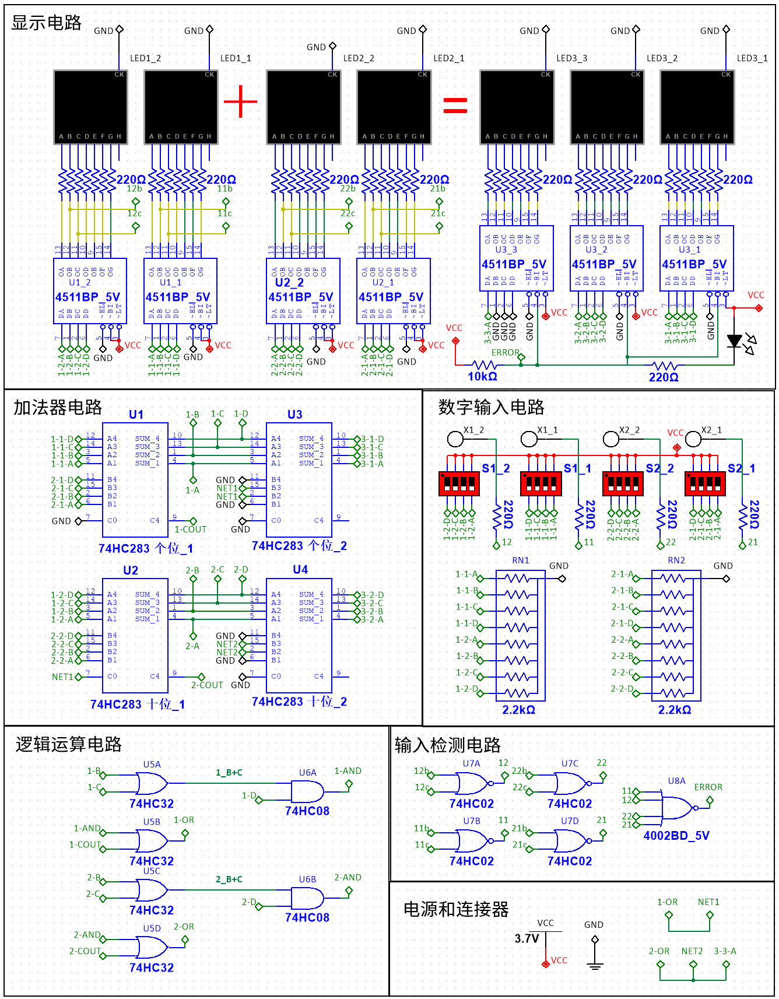

-----

# 基于74HC系列逻辑芯片的三位十进制加法器

## 简介

如图所示，这是一个使用纯数字逻辑电路实现的三位十进制加法器项目。其核心功能是计算两个两位十进制数的和，并能在0-198的范围内正确显示结果。本项目未使用微控制器（MCU），完全由标准的74HC系列逻辑芯片搭建，非常适合用于学习数字电路、BCD码（Binary-Coded Decimal）加法原理和组合逻辑电路的设计。

该设计的一大亮点是其巧妙的错误检测机制，它利用了74HC4511解码芯片的自身特性，在不增加额外比较器的情况下，实现了对非法输入（非BCD码）的检测与告警。

**核心特性:**

  * **纯硬件逻辑：** 完全由逻辑门和加法器等芯片构成，不涉及任何编程。
  * **十进制加法：** 实现两个两位数（0-99）的十进制加法。
  * **锂电池供电：** 设计工作电压为 3.3V - 4.2V，可由单节锂电池直接供电。
  * **拨码开关输入：** 通过拨码开关以BCD码格式输入两个加数。
  * **数码管显示：** 直观地显示输入的两个加数与计算结果。
  * **智能错误检测：** 自动检测无效的输入数据，并通过LED指示灯报警，同时屏蔽错误输出，确保结果的有效性。

## 电路设计详解

本电路主要由五个部分组成：数字输入电路、加法器电路、逻辑运算电路、输入检测电路以及显示电路。

### 1\. 电源与连接器

整个系统使用单节锂电池供电（标称电压3.7V，满电4.2V），电路中的 `VCC` 连接到电池正极，`GND` 连接到负极。所有芯片均由该电源供电。

### 2\. 数字输入电路

  * **输入方式：** 使用四个四位的拨码开关（`S1_1`, `S1_2`, `S2_1`, `S2_2`）作为数据输入端。其中`S1_2`和`S1_1`分别代表第一个加数的十位和个位，`S2_2`和`S2_1`则代表第二个加数的十位和个位。
  * **数据格式：** 每个四位拨码开关输入一个4位的二进制数（BCD码），代表一个0-9的十进制数字。
  * **下拉电阻：** 每个输入引脚都通过一个2.2KΩ的排阻（`RN1`, `RN2`）连接到地。这确保了当拨码开关断开（输入为0）时，输入引脚为稳定的低电平，避免了因引脚悬空而导致的逻辑错误。

### 3\. 加法器电路 (核心)

这是实现十进制加法的核心部分。由于标准的二进制加法器（如74HC283）无法直接处理十进制进位，我们需要采用“加6修正法”来实现BCD加法。

  * **第一级加法：**

      * `U1` (74HC283) 负责将两个加数的个位数（来自 `S1_1` 和 `S2_1`）进行二进制相加。
      * `U2` (74HC283) 负责将两个加数的十位数（来自 `S1_2` 和 `S2_2`）进行二进制相加。

  * **第二级加法（加6修正）：**

      * `U3` (74HC283) 和 `U4` (74HC283) 是修正加法器。
      * 当第一级加法的结果大于9或产生了进位时，其结果并非有效的BCD码。此时，需要给这个结果加上6（二进制`0110`），才能将其修正为正确的BCD码格式，并产生正确的十进制进位。
      * `U3` 用于修正个位，`U4` 用于修正十位。修正的触发条件由下述的“逻辑运算电路”提供。

### 4\. 逻辑运算电路 (进位控制)

该电路是实现“加6修正”的关键，它负责判断第一级加法的结果是否需要修正，并产生进位信号。

* **判断条件：** 对于4位二进制加法器的输出，当其结果大于9（即二进制为 $1010_2$ 及以上）或产生了进位（`C4=1`）时，需要进行加6修正。
  * **电路实现：**
      * 使用 `74HC08` (与门) 和 `74HC32` (或门) 组合来检测“和大于9”的条件。例如，对于个位加法器`U1`的输出 `S4 S3 S2 S1`，判断条件为 `C4 OR [(S2 OR S3) AND S4]`。
      * 当该条件满足时，逻辑电路会输出一个高电平信号。这个信号兵分两路：
        1.  作为下一位（十位）加法器 `U2` 的进位输入（`C0`）。
        2.  作为本位（个位）修正加法器 `U3` 的输入，使其执行“加6”操作。
      * 十位到百位的进位逻辑与此完全相同。

### 5\. 显示电路

  * **解码驱动：** 使用7片 `74HC4511` BCD转7段解码驱动芯片。由于Multisim中缺少该模型，仿真时使用了功能兼容的 `4511BP`。
  * **输入显示：** 四片`74HC4511`分别连接到四个拨码开关，用于实时显示用户输入的两个加数。
  * **结果显示：** 三片`74HC4511`用于显示最终的计算结果（百位、十位、个位）。它们的数据输入分别来自个位修正加法器`U3`的输出、十位修正加法器`U4`的输出，以及十位产生的最终进位信号。
  * **限流电阻：** 每个数码管的a-g段都串联了一个220Ω的电阻，用于限制电流，保护数码管和驱动芯片。

### 6\. 输入检测电路 (创新点)

这是一个非常巧妙的设计，它利用了 `74HC4511` 芯片的内在逻辑特性来实现输入错误检测。

  * **检测原理：** 查阅`74HC4511`的数据手册可以发现，对于任何有效的BCD码输入（0-9），其驱动的七段数码管中，'b'段和'c'段的输出信号至少有一个是高电平。只有当输入为无效码（10-15）时，'b'段和'c'段的输出会**同时变为低电平**。
  * **电路实现：**
      * 我们利用这个特性，使用 `74HC02` (或非门) 来监测每个输入数码管驱动芯片的'b'段和'c'段输出。当`b`和`c`同时为低电平时，或非门的输出将变为高电平，表示检测到错误输入。
      * 每个输入位都对应一个或非门（`U7A` 到 `U7D`）和一个红色LED错误指示灯。
      * `4002B` 是一个4输入或非门，它将四个输入位的错误信号整合在一起。只要有任何一个输入位出错，`4002B`的输出就会变为低电平。
  * **错误处理：**
      * `4002B` 输出的低电平信号 `ERROR` 会触发两个动作：
        1.  点亮一个总的错误指示灯。
        2.  该信号连接到百位结果的 `74HC4511` 驱动芯片的**Blanking Input (`BI`)** 引脚。低电平有效，会使百位数码管熄灭，从而避免在输入错误的情况下显示一个无意义的计算结果。

## 使用说明

1.  接通3.7V锂电池电源。
2.  通过拨动四个拨码开关，分别设置第一个加数（左侧两位）和第二个加数（右侧两位）的BCD码。
3.  输入的同时，上方的数码管会显示您输入的数值。
4.  下方的等号后的三位蓝色数码管会实时显示加法结果。
5.  如果您输入的不是有效的BCD码（例如拨动了`1100`，即十进制12），对应输入位旁边的红色`ERROR`灯会亮起，同时总结果的百位将被熄灭以示警告。

## 物料清单 (BOM)

| 元件类型         | 数量 | 型号/规格               |
|--------------|----|---------------------|
| 4位二进制全加器     | 4  | 74HC283             |
| BCD-7段解码/驱动器 | 7  | 74HC4511 (或 CD4511) |
| 2输入四或门       | 2  | 74HC32              |
| 2输入四与门       | 1  | 74HC08              |
| 2输入四或非门      | 1  | 74HC02              |
| 4输入双或非门      | 1  | 4002B               |
| 共阴极七段数码管     | 7  | -                   |
| LED          | 5  | 红色, 3mm/5mm         |
| 4位DIP拨码开关    | 4  | -                   |
| 4位排阻         | 2  | 2.2KΩ               |
| 电阻           | 1  | 10KΩ                |
| 电阻           | 53 | 220Ω                |
| 电池座          | 1  | 适用于18650等锂电池        |

## 结语

这个项目不仅是一个功能性的计算器，更是一个展现数字逻辑之美的绝佳范例。从基本的门电路到组合逻辑的应用，再到巧妙的错误检测设计，每一步都蕴含着数字世界的底层规律。希望这个开源设计能对您有所启发和帮助！

-仿真工程文件下载： [ 74HC-series-adder-project.ms14](./74HC-series-adder-project.ms14)

-----